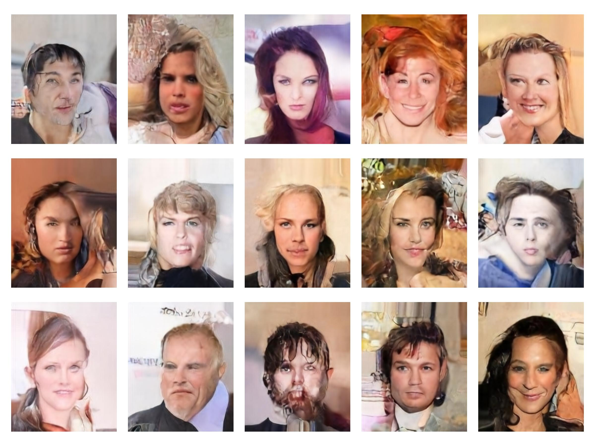
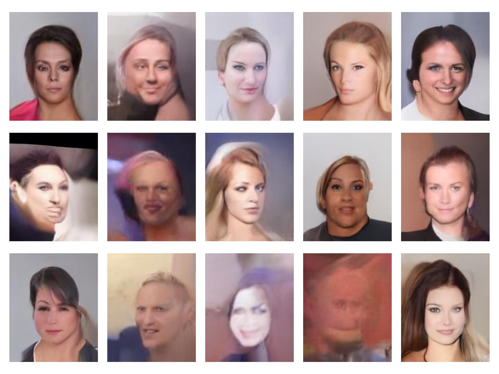
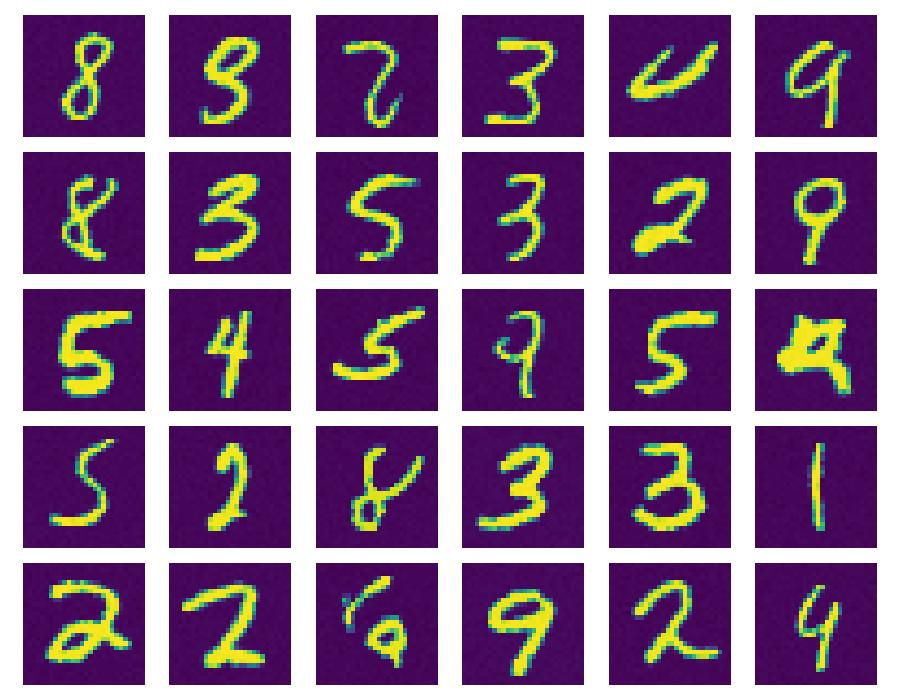

# Latent diffusion (from scratch)
This project is a reproduction and exploration of the latent diffusion framework introduced in ["High-Resolution Image Synthesis with Latent Diffusion Models"](https://arxiv.org/abs/2112.10752) by Robin Rombach, Andreas Blattmann, Dominik Lorenz, Patrick Esser, Björn Ommer.

The aim is to provide a simple PyTorch implementation capable of realistic image generation.

Note that this is a work in progress. Currently the code comprises
- An end-to-end implementation of the latent diffusion pipeline for image generation
- Training autoencoders, using variational KL-divergence regularization (similar to a VAE) and a GAN-type loss based on a patch-based discriminator
- Unconditional image generation based on the [CelebA dataset](https://mmlab.ie.cuhk.edu.hk/projects/CelebA.html)
- A simplified UNet architecture without attention blocks (these blocks will be added in the future)
- As a baseline and sanity check, a diffusion-only model for generating MNIST digits.

## Sample outputs


Sample generated images from a model trained for 10 epochs on the [CelebA dataset](https://mmlab.ie.cuhk.edu.hk/projects/CelebA.html).
Training time was short; quality should improve with longer runs.

<br>
<br>



Sample from the same model as the previous figure, but using a lower $\sigma$ at each denoising step. Specifically, this result used $\sigma=0.95\sqrt{\beta_t}$ where $\beta_t$ is the schedule variance.

<br>
<br>



Sample outputs from a simple DDPM trained on MNIST

## Overview
The basic training pipeline consists in the following steps

1. **Train an autoencoder** whose task is to compress the image data into a lower-dimensional latent space. This uses a combination of an l2 reconstruction loss, a KL-divergence regularization (like a Variational Auto-Encoder) to maintain a standard scaling of the latent space, and a GAN-based loss using a patch-based discriminator to promote high image fidelity.
2. **Construct a dataset of encoded images.** To save time thile training the denoiser, a dataset of encoded versions of all images in the dataset is cached to disk. This saves inference time needed to do the encoding at the expense of higher disk usage.
3. **Train a denoiser** to do epsilon-prediction in the latent space.

At generation time the process is

1. Sample latent noise from a standard normal distribution
2. Do DDPM sampling with the denoiser to reconstruct a latent code corresponding to a realistic image
3. Decode the latent representation into an image.

## Running

### Environment
Install dependencies:
```bash
python3 -m pip install -r requirements.txt
```

### Baseline diffusion model (MNIST)

Train:
```bash
python3 mnist_diffusion.py --train
```
Generate samples:
```bash
python3 mnist_diffusion.py --show checkpoints/mnist/XXX.safetensors
```
Checkpoints are saved to `checkpoints/mnist`.

### Latent diffusion on the CelebA dataset

#### Step 1 - Train an autoencoder
```bash
python3 train_encoder.py
```
Outputs:
- Autoencoder checkpoints are saved to: `checkpoints/autoencoder/`
- Discriminator checkpoints are saved to `checkpoints/discriminator/`
- Training diagnostics (examples of reconstructions, discriminator confidences, loss curves etc) are saved to `fig/autoencoder/`

#### Step 2 - Cache latent encodings (automatic)
When training the denoiser, the dataset is automatically encoded and cached to `encoded_img/`.

**Note:**
Caching consumes **~5 GB per trained autoencoder**, since all training images are stored as latents. This makes denoiser training significantly faster.

#### Step 3 - Train the denoiser

```bash
python3 latent_diffusion.py --train --encoder checkpoints/autoencoder/AAA.safetensors
```
Outputs:
- Denoiser checkpoints are saved to `checkpoints/denoiser`
- Training diagnostics (example predictions, bucketized loss curves etc) are saved to `fig/denoiser/`:

#### Step 4 - Generating images
```bash
python3 latent_diffusion.py \
    --show checkpoints/denoiser/DDD.safetensors \
    --encoder checkpoints/autoencoder/AAA.safetensors
```
The generated images are shown directly to the user and also saved to `fig/denoiser/`


